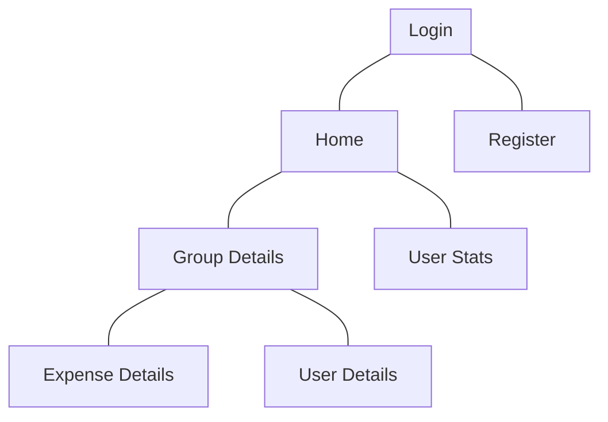

# Pages_Mobile


The Following Flowchart is detailing the organization of the app pages :


We used `navigation compose` to control navigation in the app

in Addition, here are the routes of the app :

```Kotlin
object Routes {
    const val HOME = "home"
    const val REGISTER = "register"
    const val LOGIN = "login"
    const val GROUP_DETAILS = "groupDetails"
    const val USER_DETAILS = "userDetails"
    const val EXPENSE_DETAILS = "expenseDetails"
    const val USER_STATS = "userStats"
}
```